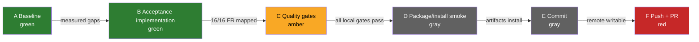

# Quillr A+ release cockpit

Updated: 2026-07-17 | Branch: `quality/a-plus-20260717` | Target: release candidate

## Cockpit

| Gate | State | Evidence |
|---|---|---|
| TypeScript tests | in progress | `npm test` |
| Rust tests | in progress | `cargo test --manifest-path crates/httpora-core/Cargo.toml --all-features` |
| Functional journey coverage | in progress | `docs/quality/TRACEABILITY.md` |
| Overall traceability | in progress | `artifacts/quality/traceability.json` |
| Strict lint/type/format | in progress | `eslint.config.mjs`, CI quality job |
| Dependency security | in progress | `npm audit`, `cargo audit`, Trivy workflows |
| Package/build/install | in progress | npm and Cargo package smoke commands |
| Remote release | blocked | GitHub repository is archived; no release exists |

## Progress bars

- Implementation: `[█████████░] 90%` — acceptance suite and retry configuration are implemented.
- Local gates: `[██████░░░░] 60%` — verification must refresh this cockpit with results.
- Traceability: `[██████████] 100%` — `24/24`; generated gate remains mandatory.
- Publication: `[░░░░░░░░░░] 0%` — archived remote blocks push, PR, and release.

## DAG

Node colors: green = complete, amber = active, red = blocked, gray = queued. Edge labels are exit
conditions; every node has one state.

Valid edges: `A→B→C→D→E→F`. Critical path is `C→D→E`; `F` is externally blocked.

## WBS

| ID | Work package | Status | Exit evidence |
|---|---|---|---|
| 1.0 | Establish clean baseline | done | baseline commands in this cockpit |
| 2.0 | Replace pending acceptance skeletons | done | TypeScript and Rust requirements tests |
| 3.0 | Enforce traceability >=85% | done | `24/24 = 100%` generated JSON |
| 4.0 | Enforce lint/type/security gates | active | local commands and `.github/workflows/quality-gate.yml` |
| 5.0 | Package/build/install smoke | queued | npm tarball and Cargo package evidence |
| 6.0 | Preserve in Git | queued | branch commit |
| 7.0 | Push/PR/release | blocked | archived GitHub repository |

## Requirement and release specification

The normative product requirements remain in `docs/specs/SPEC.md`. Release acceptance adds:

1. All 16 functional requirements have executable acceptance evidence.
2. All 24 functional/non-functional requirements have a verified trace row.
3. TypeScript test, lint, typecheck, build, format, audit, package, and install gates pass.
4. Rust test (default/no-default/all-feature), fmt, clippy-deny-warnings, package, and install/use
   smoke gates pass.
5. No publish occurs while the remote is archived or any local gate is red.

## ADR-001: Executable traceability is the release gate

Status: accepted.

Decision: derive coverage from requirement IDs in `SPEC.md` and verified matrix rows, emit a
machine-readable artifact, and require executable evidence for each row. Functional journey
coverage is the fraction of FRs with acceptance tests.

Rationale: the prior hand-authored `90%` badge and `75%` placeholder gate were not reproducible.
Alternatives rejected: counting source comments (not behavioral proof), or treating skipped/todo
tests as covered (inflates pass and coverage metrics).

## ADR-002: Do not publish from an archived repository

Status: accepted.

Decision: prepare and commit a verified release candidate locally, but do not unarchive, publish,
or redirect remotes without repository-owner authorization.

## Risk and control register

| Risk | Probability | Impact | Control | State |
|---|---|---|---|---|
| Archived remote prevents preservation/PR | certain | high | local commit; report exact unblock action | open |
| Placeholder tests inflate readiness | high | high | replace with executable acceptance tests; report ignored/todo counts | controlled |
| Package metadata points to stale repo name | medium | medium | package dry-run/install smoke; correct before publish | open |
| Feature combinations regress | medium | high | no-default and all-feature Cargo tests | controlled |
| Supply-chain vulnerability | medium | high | npm audit, Cargo audit/Trivy; never publish with high findings | controlled |
| Coverage claim drifts from spec | medium | high | generated JSON from spec and matrix; 85% hard gate | controlled |

## Baseline evidence

- Git: clean `main` at `e2501987af10f661d35a89848cb877c6198030fb`; one worktree.
- Remote: `KooshaPari/Quillr`, default `main`, archived, latest release `null`.
- TypeScript baseline: `27 passed / 27 executed = 100%`; 18 todo, so declared acceptance
  completion was `0/18 = 0%`.
- Rust baseline: `50 passed / 50 executed = 100%`; 16 ignored acceptance tests and one ignored
  doc-test.
- Baseline lint: failed because ESLint 10 had no flat configuration.
- Baseline typecheck: passed.
- Baseline npm audit: 0 vulnerabilities.
- Baseline Rust clippy with warnings denied: passed.
- Baseline code coverage: unknown; `npm test -- --coverage` could not run because the coverage
  provider was absent. The concrete measurement work item is `npm run test:coverage`.
